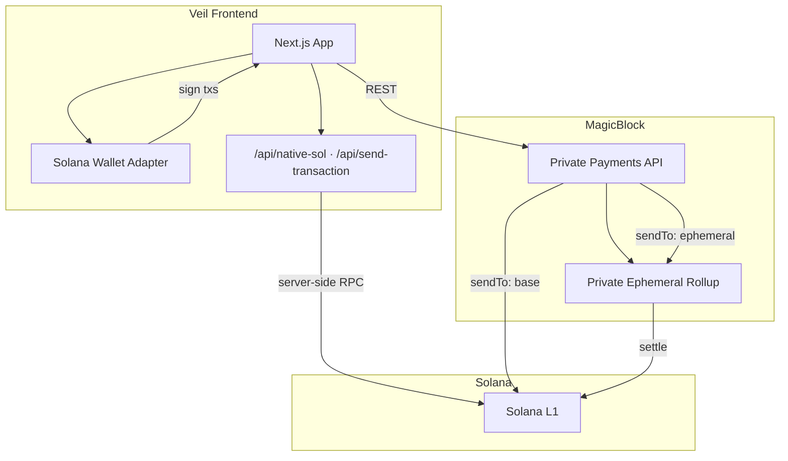

# Veil — Developer Guide

Technical documentation for running, deploying, and contributing to Veil locally.

**Product site:** [veil.notcodesid.com](https://veil.notcodesid.com/)

## Status

Mainnet MVP verified end-to-end:

| Flow | Mainnet |
|------|---------|
| Wallet connect + MagicBlock auth | ✅ |
| Shield | ✅ |
| Private swap (SOL → USDC) | ✅ |
| Unshield | ✅ |
| Portfolio | ✅ |

Swap execution requires **mainnet** (Jupiter routes). Devnet supports shield/unshield; swap quotes work but execution does not.

## Architecture

Integrate-first: no custom Anchor program. Veil calls the [MagicBlock Private Payments API](https://docs.magicblock.gg/pages/private-ephemeral-rollups-pers/api-reference/per/introduction).



### User flow → API mapping

```
Connect wallet → MagicBlock auth → Shield → Swap → Unshield → Portfolio
```

| Step | API | What happens |
|------|-----|----------------|
| Auth | `GET /v1/spl/challenge` + `POST /v1/spl/login` | Wallet signs challenge; bearer token unlocks private balance reads |
| Shield | `POST /v1/spl/deposit` | SPL moves from L1 wallet into the Private ER |
| Quotes | `GET /v1/swap/quote` | Live pricing (polled every 2s; refreshed on execute) |
| Swap | `POST /v1/swap/swap` | Private swap tx (`visibility: private`) |
| Unshield | `POST /v1/spl/withdraw` | SPL moves from PER back to L1 wallet |
| Portfolio | `GET /v1/spl/private-balance` | Shielded holdings inside the rollup |

Signed transactions submit via `/api/send-transaction` (server-side RPC). Native SOL balances read via `/api/native-sol` — both avoid browser 403s on public RPC endpoints.

## Stack

| Layer | Choice |
|-------|--------|
| Framework | Next.js 16 (App Router) |
| Language | TypeScript |
| UI | Tailwind v4 + shadcn/ui |
| Wallet | Solana Wallet Adapter |
| Privacy / SPL | MagicBlock Private Payments API |
| Pricing | Jupiter via MagicBlock `/v1/swap/*` |
| Analytics | Vercel Analytics |
| Chain | Solana mainnet (default) |

## Project structure

```
app/
  api/native-sol/       # Server-side native SOL balance
  api/send-transaction/ # Server-side tx submission
  trade/                # Shield · Swap · Unshield
  portfolio/
components/             # UI, forms, wallet status
hooks/                  # Balances, price stream, tx execution
lib/magicblock/         # API clients (auth, shield, swap, unshield, balance)
providers/              # Wallet, MagicBlock auth, balances
scripts/                # Pre-deploy smoke tests
```

## Getting started

```bash
bun install
cp .env.example .env.local
bun dev
```

Open [http://localhost:3000](http://localhost:3000).

### Environment

**Mainnet (default):**

```bash
NEXT_PUBLIC_CLUSTER=mainnet
NEXT_PUBLIC_MAGICBLOCK_API=https://payments.magicblock.app
NEXT_PUBLIC_SOLANA_RPC=https://api.mainnet-beta.solana.com
NEXT_PUBLIC_TEE_RPC=https://tee.magicblock.app
```

**Devnet (shield/unshield testing only):**

```bash
NEXT_PUBLIC_CLUSTER=devnet
NEXT_PUBLIC_SOLANA_RPC=https://api.devnet.solana.com
NEXT_PUBLIC_TEE_RPC=https://devnet-tee.magicblock.app
```

Public mainnet RPC is acceptable for low traffic — balance and tx calls run server-side. Use a dedicated RPC (e.g. Helius) if you hit rate limits.

### Implementation notes

- SOL balance display uses **native SOL** via `/api/native-sol`, not WSOL ATA.
- SOL shield may require WSOL in edge cases; USDC shield is smoother.
- Swap reserves **0.003 SOL** for fees; slippage defaults to **1%**.
- Always follow `sendTo` from MagicBlock API responses for RPC routing.
- Private swaps only: `visibility: "private"`.

## Scripts

```bash
bun run dev      # local dev server
bun run build    # production build
bun run lint     # ESLint

node scripts/verify-api.mjs   # MagicBlock API smoke test (no wallet)
node scripts/verify-e2e.mjs   # Devnet E2E (requires funded keypair)
```

## Deploy (Vercel)

1. Push to GitHub and import on Vercel (or `vercel --prod`)
2. Set mainnet environment variables (see above)
3. Redeploy after env changes
4. Smoke test: connect → balances → small swap

Vercel Analytics is wired in `app/layout.tsx`. Enable **Analytics** in the Vercel project dashboard.

## References

- [MagicBlock docs](https://docs.magicblock.gg)
- [Private Payments API](https://docs.magicblock.gg/pages/private-ephemeral-rollups-pers/api-reference/per/introduction)
- [MagicBlock reference app](https://one.magicblock.app/)

## License

MIT