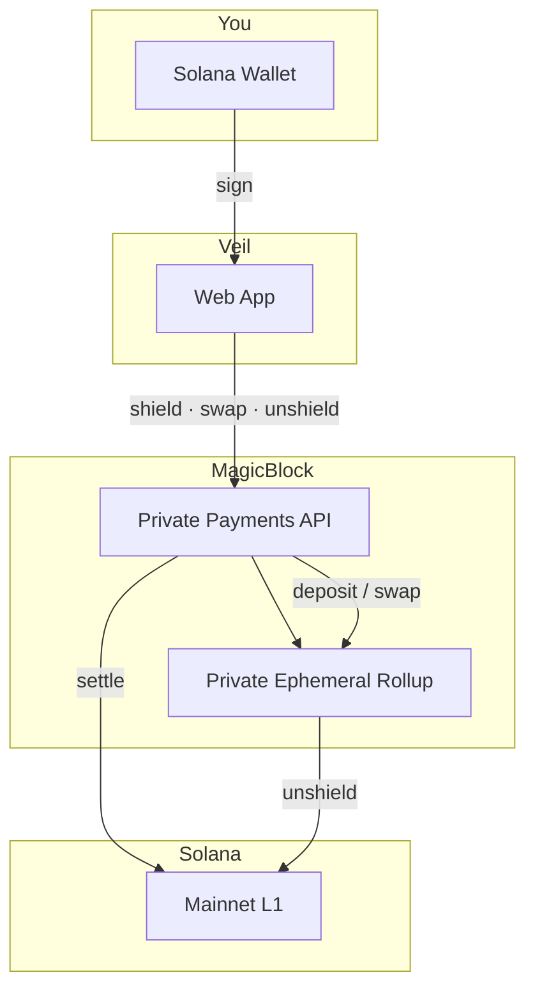

# Veil

**Trade privately, settle publicly.**

Veil is a private DEX on Solana. Shield your tokens, swap with hidden order flow, and settle back to your wallet — powered by [MagicBlock](https://www.magicblock.xyz/) Private Ephemeral Rollups.

**[veil.notcodesid.com](https://veil.notcodesid.com/)**

## What you can do

- **Shield** — move SOL or USDC from your wallet into a private rollup
- **Swap** — trade with live quotes and private execution (no public mempool exposure)
- **Unshield** — withdraw back to your Solana wallet
- **Portfolio** — see wallet vs shielded balances in one place

## How it works

1. Connect your wallet (Phantom, Backpack, etc.)
2. Sign once to authenticate with MagicBlock
3. **Shield** tokens you want to hold or trade privately
4. **Swap** between SOL and USDC
5. **Unshield** when you want funds back in your wallet

## Architecture

Veil is a frontend on [MagicBlock](https://www.magicblock.xyz/) Private Ephemeral Rollups. Your wallet signs transactions; MagicBlock builds and routes them between Solana L1 and a private rollup (PER).

| Step | What happens |
|------|----------------|
| **Shield** | Tokens move from your wallet into the private rollup |
| **Swap** | Trade executes privately inside the rollup — no public order flow |
| **Unshield** | Tokens settle back to your Solana wallet on L1 |

## Before you trade

- Use a **mainnet** wallet with real SOL (and USDC if shielding USDC)
- Start with **small amounts** while you learn the flow
- Leave a little SOL in your wallet for network fees (~0.003 SOL minimum for swaps)
- Shielded balances stay at zero until your first deposit — that’s normal

## Why Veil

- **Private execution** — trades run inside MagicBlock rollups before settling on-chain
- **No sandwich attacks** — order flow isn’t visible in the public mempool
- **Native Solana** — no bridges, no wrapped assets to manage
- **Simple flow** — shield, swap, unshield in one app

## Links

- [Trade now](https://veil.notcodesid.com/trade)
- [MagicBlock](https://www.magicblock.xyz/)
- [Terms](/terms) · [Privacy](/privacy)

---

Developers and contributors: see [DEVELOPERS.md](./DEVELOPERS.md).