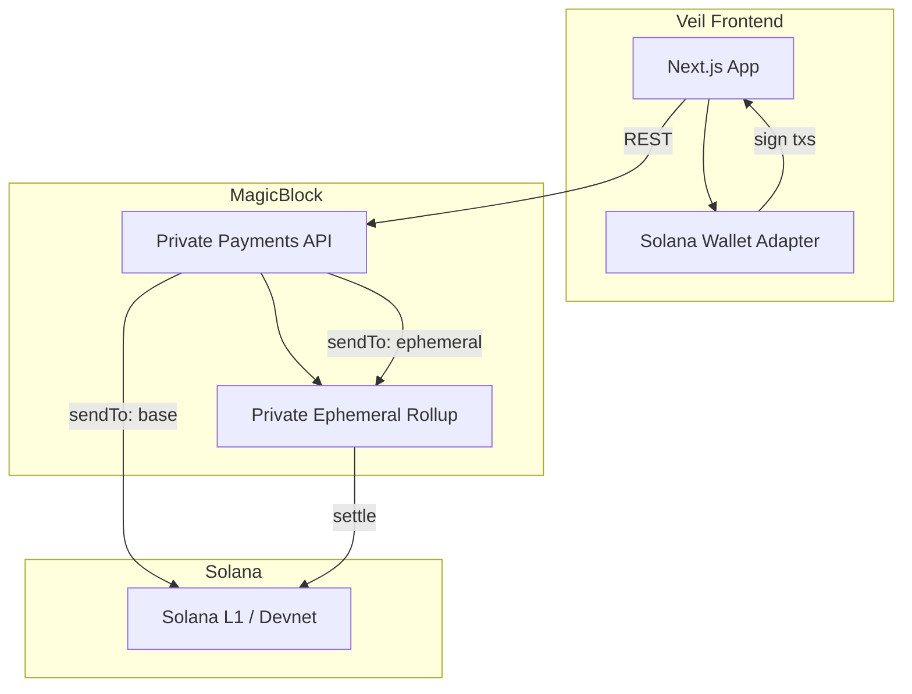

# Veil

**Trade privately, settle publicly.**

Veil is a private DEX frontend built on [MagicBlock](https://www.magicblock.xyz/) Private Ephemeral Rollups (PER). Shield SPL tokens into a private rollup, stream live swap quotes, execute with private visibility, and unshield back to Solana L1.

## Features

- **Shield** — deposit SOL or USDC from your wallet into a Private ER
- **Swap** — live price quotes with private execution (`visibility: private`)
- **Unshield** — withdraw shielded tokens back to your Solana wallet
- **Portfolio** — view wallet vs shielded balances after MagicBlock auth

## Architecture

Integrate-first MVP: no custom Anchor program. Veil calls the [MagicBlock Private Payments API](https://docs.magicblock.gg/pages/private-ephemeral-rollups-pers/api-reference/per/introduction), which builds unsigned transactions and routes them to Solana L1 or the PER (TEE RPC).



### User flow

```
Connect wallet → MagicBlock auth → Shield → Swap (quotes + private execute) → Unshield → Portfolio
```

| Step | API | What happens |
|------|-----|----------------|
| Auth | `GET /v1/spl/challenge` + `POST /v1/spl/login` | Wallet signs a challenge; bearer token unlocks private balance reads |
| Shield | `POST /v1/spl/deposit` | SPL moves from L1 wallet into the Private ER |
| Quotes | `GET /v1/swap/quote` | Live swap pricing (polled every 2s in the UI) |
| Swap | `POST /v1/swap/swap` | Builds a private swap tx (`visibility: private`) |
| Unshield | `POST /v1/spl/withdraw` | SPL moves from PER back to L1 wallet |
| Portfolio | `GET /v1/spl/private-balance` | Reads shielded holdings inside the rollup |

Transactions are decoded from `transactionBase64`, signed in the browser, and sent to the RPC indicated by `sendTo` (`base` → Solana RPC, `ephemeral` → TEE RPC).

## Stack

| Layer | Choice |
|-------|--------|
| Framework | Next.js 16 (App Router) |
| Language | TypeScript |
| UI | Tailwind v4 + shadcn/ui |
| Wallet | Solana Wallet Adapter |
| Privacy / SPL | MagicBlock Private Payments API |
| Chain | Solana devnet (default) |

## Project structure

```
app/              # Pages (landing, trade, portfolio)
components/       # UI, forms, wallet status
hooks/            # Balances, price stream, tx execution
lib/magicblock/   # API clients (auth, shield, swap, unshield, balance, tx)
providers/        # Wallet, MagicBlock auth, balances
```

## Getting started

```bash
bun install
cp .env.example .env.local
bun dev
```

Open [http://localhost:3000](http://localhost:3000).

### Environment

```bash
NEXT_PUBLIC_CLUSTER=devnet
NEXT_PUBLIC_MAGICBLOCK_API=https://payments.magicblock.app
NEXT_PUBLIC_SOLANA_RPC=https://api.devnet.solana.com
NEXT_PUBLIC_TEE_RPC=https://devnet-tee.magicblock.app
```

Use a dedicated devnet RPC (e.g. Helius) if you hit public RPC rate limits.

### Devnet wallet setup

1. Set Phantom to **Devnet**
2. Airdrop SOL on devnet
3. Get devnet USDC from the [Circle faucet](https://faucet.circle.com/)
4. Connect on `/trade` → sign MagicBlock auth → Shield → check Portfolio

> **Note:** Swap quotes use Jupiter routes via MagicBlock. On devnet, shield/unshield use devnet USDC; swap input works best as **SOL → USDC**. Full private swap execution is intended for mainnet.

## Status

MVP wired on devnet — shield, quotes, unshield, and portfolio are implemented. Mainnet deployment and swap execution verification are next.

## Links

- [MagicBlock docs](https://docs.magicblock.gg)
- [Private Payments API](https://docs.magicblock.gg/pages/private-ephemeral-rollups-pers/api-reference/per/introduction)
- [MagicBlock reference app](https://one.magicblock.app/)

## License

MIT