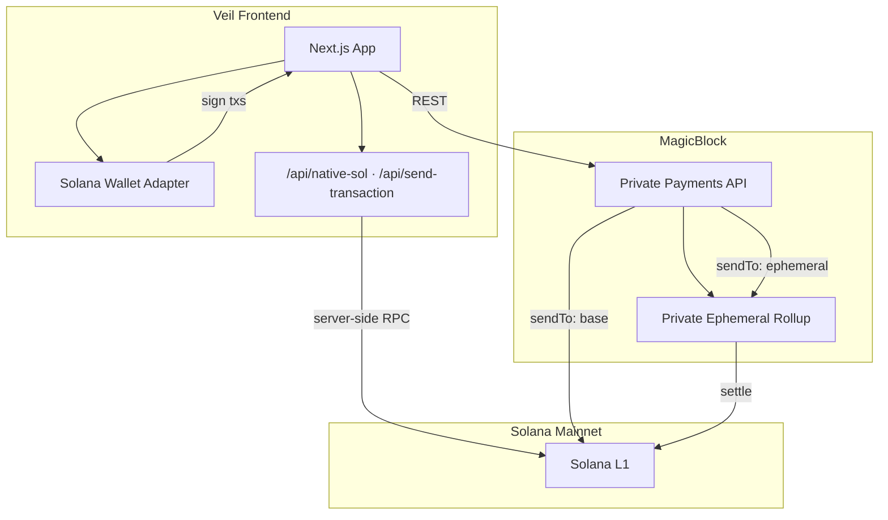

# Veil

**Trade privately, settle publicly.**

Veil is a private DEX frontend on [MagicBlock](https://www.magicblock.xyz/) Private Ephemeral Rollups (PER). Shield SPL tokens into a private rollup, stream live swap quotes, execute with private visibility, and unshield back to Solana L1.

**Live:** [veil.notcodesid.com](https://veil.notcodesid.com/)

## Features

- **Shield** — deposit SOL or USDC from your wallet into a Private ER
- **Swap** — live Jupiter quotes with private execution (`visibility: private`)
- **Unshield** — withdraw shielded tokens back to your Solana wallet
- **Portfolio** — wallet vs shielded balances after MagicBlock auth

## Status

Mainnet MVP is complete and verified end-to-end:

| Flow | Mainnet |
|------|---------|
| Wallet connect + MagicBlock auth | ✅ |
| Shield | ✅ |
| Private swap (SOL → USDC) | ✅ |
| Unshield | ✅ |
| Portfolio | ✅ |

Swap execution requires **mainnet** (Jupiter routes). Devnet supports shield/unshield only; swap quotes work but execution does not.

## Architecture

Integrate-first: no custom Anchor program. Veil calls the [MagicBlock Private Payments API](https://docs.magicblock.gg/pages/private-ephemeral-rollups-pers/api-reference/per/introduction), which builds unsigned transactions and routes them to Solana L1 or the PER (TEE RPC).



### User flow

```
Connect wallet → MagicBlock auth → Shield → Swap → Unshield → Portfolio
```

| Step | API | What happens |
|------|-----|----------------|
| Auth | `GET /v1/spl/challenge` + `POST /v1/spl/login` | Wallet signs a challenge; bearer token unlocks private balance reads |
| Shield | `POST /v1/spl/deposit` | SPL moves from L1 wallet into the Private ER |
| Quotes | `GET /v1/swap/quote` | Live swap pricing (polled every 2s; refreshed again on execute) |
| Swap | `POST /v1/swap/swap` | Builds a private swap tx (`visibility: private`) |
| Unshield | `POST /v1/spl/withdraw` | SPL moves from PER back to L1 wallet |
| Portfolio | `GET /v1/spl/private-balance` | Reads shielded holdings inside the rollup |

Signed transactions are submitted through `/api/send-transaction` (server-side RPC) to avoid browser 403 errors on public endpoints. Native SOL balances are read via `/api/native-sol` for the same reason.

## Stack

| Layer | Choice |
|-------|--------|
| Framework | Next.js 16 (App Router) |
| Language | TypeScript |
| UI | Tailwind v4 + shadcn/ui |
| Wallet | Solana Wallet Adapter |
| Privacy / SPL | MagicBlock Private Payments API |
| Pricing | Jupiter via MagicBlock `/v1/swap/*` |
| Analytics | Vercel Analytics |
| Chain | Solana mainnet (default) |

## Project structure

```
app/
  api/native-sol/       # Server-side native SOL balance
  api/send-transaction/ # Server-side tx submission
  trade/                # Shield · Swap · Unshield
  portfolio/
components/             # UI, forms, wallet status
hooks/                  # Balances, price stream, tx execution
lib/magicblock/         # API clients (auth, shield, swap, unshield, balance)
providers/              # Wallet, MagicBlock auth, balances
scripts/                # Pre-deploy API / E2E smoke tests
```

## Getting started

```bash
bun install
cp .env.example .env.local
bun dev
```

Open [http://localhost:3000](http://localhost:3000).

### Environment

**Mainnet (default):**

```bash
NEXT_PUBLIC_CLUSTER=mainnet
NEXT_PUBLIC_MAGICBLOCK_API=https://payments.magicblock.app
NEXT_PUBLIC_SOLANA_RPC=https://api.mainnet-beta.solana.com
NEXT_PUBLIC_TEE_RPC=https://tee.magicblock.app
```

**Devnet (shield/unshield testing only):**

```bash
NEXT_PUBLIC_CLUSTER=devnet
NEXT_PUBLIC_SOLANA_RPC=https://api.devnet.solana.com
NEXT_PUBLIC_TEE_RPC=https://devnet-tee.magicblock.app
```

For higher traffic or fewer rate limits, use a dedicated RPC (e.g. Helius) in `NEXT_PUBLIC_SOLANA_RPC`. The public mainnet endpoint is fine for early/low traffic because balance reads and tx submission run server-side.

### Wallet setup (mainnet)

1. Set Phantom (or Backpack) to **Mainnet**
2. Fund wallet with SOL (and USDC if shielding USDC)
3. Connect on `/trade` → approve MagicBlock auth sign message
4. **Shield** — pick SOL or USDC, deposit into the Private ER
5. **Swap** — SOL → USDC works best; use a small amount first (e.g. `0.005 SOL`)
6. **Unshield** — withdraw shielded tokens back to wallet
7. Check **Portfolio** for shielded balances

### Usage notes

- **SOL balance display** uses native SOL (what your wallet shows), not wrapped SOL.
- **SOL shield** may require wrapped SOL (WSOL) in edge cases; USDC shield is the smoother path.
- **Swap** leaves a **0.003 SOL** fee reserve; do not swap your full balance.
- **Slippage** defaults to **1%**; quotes are refreshed immediately before each swap.
- **Shielded balances** show `0` until you complete your first shield.

## Scripts

```bash
bun run dev      # local dev server
bun run build    # production build
bun run lint     # ESLint

node scripts/verify-api.mjs   # MagicBlock API smoke test (no wallet)
node scripts/verify-e2e.mjs   # Devnet E2E (requires funded keypair)
```

## Deploy (Vercel)

1. Push to GitHub and import on Vercel (or `vercel --prod`)
2. Set environment variables (mainnet block above)
3. Redeploy after env changes
4. Smoke test on the live URL: connect → balances → small swap

Vercel Analytics is included via `@vercel/analytics` in the root layout. Enable **Analytics** in the Vercel project dashboard to view traffic.

## Links

- [Veil (live)](https://veil.notcodesid.com/)
- [MagicBlock docs](https://docs.magicblock.gg)
- [Private Payments API](https://docs.magicblock.gg/pages/private-ephemeral-rollups-pers/api-reference/per/introduction)
- [MagicBlock reference app](https://one.magicblock.app/)

## License

MIT